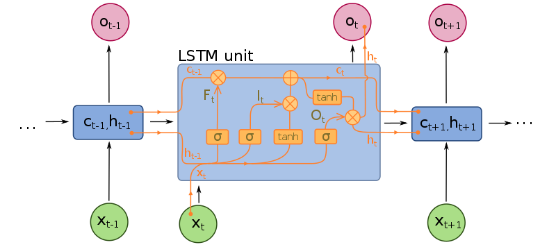

## Table of contents
* [Basic](#1.Basic)
* [Cross-entropy method](#cross-entropy-method)
* [Tabular Learning](#tabular-learning)
* [DQN](#deep-q-learning)
* [Policy Gradients](#policy-gradients)
* [DRL in NLP](#Deep-Reinforcement-Learning (Deep RL) in-Natural-Language-Processing (NLP))
* [NN functions](#nn-functions)

## basic

#####  Markov Decision Process (MDP)


 environment, state, observation, reward, action, agent

##### Policy

$$
\pi: S \times A \to [0,1]\\ \label{l1}
\pi(a|s) = P(a_t=a|s_t=s)
$$


##### State-value function

$$
R = \Sigma_{t = 0}^{\infty}\gamma^tr_t\\ \label{l2}
V_\pi(s) = E[R] = E[\Sigma_{t = 0}^{\infty}\gamma^tr_t|s_0 = s]\\
$$

where $r_t$ is the reward at step $t$,  $\gamma\in[0,1]$  is the discount-rate.

##### Value function

$$
V^\pi(s)  =E[R|s,\pi]\\	\label{l3}
V^*(s) = \max_\pi V^\pi(s)
$$

##### Action value function

$$
Q^\pi(s,a) = E[R|s,a,\pi]\\ \label{l4}
Q^*(s) = \max_a Q^\pi(s,a)
$$

### method classification

- model-based: previous observation **predict** following rewards and observations
- model-free: train it by intuition 
- police-based: **directly** approximating the policy of the agent
- value-based: the agent calculates the **value of every possible action**
- off police: the ability of the method to learn on old **historical data** (obtained
- on police: requires **fresh data** obtained from the environment


### Police-based method

**just like a classification problem**

- NN input: observation
- NN output: distribution of actions
- agent: random choose action base on distribution of actions(police)


## cross-entropy method

#### steps:

1. Play N number of episodes using our current model and environment. 
2. Calculate the total reward for every episode and decide on a reward boundary. Usually, we use some percentile of all rewards, such as 50th or 70th.
3. Throw away all episodes with a reward below the boundary. 
4. Train on the remaining "elite" episodes using observations as the input and issued actions as the desired output.
5. Repeat from step 1 until we become satisfied with the result.

use **cross-entropy loss** function as loss function

**drawback:** Cross-entropy methods have difficult to understand which step or which state is good and which is not good, it just know overall this episode is better or not


## tabular learning

### Why using Q but not V?

​	if I know the value of current state, I know the state is good or not, but I don't know how to choose next action, even I know the V of all next state, I **can not directly** know which action i need to do, so we decide action base on Q.

​	if I know Q of all available action, we just choose the action which has max Q, then this action surely has max V according the definition of V(the relationship of Q and V).

### The value iteration in the Env with a loop

If there is no $\gamma (\gamma = 1)$ and the environment has a loop, the value of state will be infinite.

### problems  in Q-learning

- state is not discrete
- state space is is very large
- don't know probability of action and reward matrix (P(s',r|s,a)). 

### Value iteration 

#### Reward table

- index: "source state" + "action" + "target state"
- value: reward

#### Transition table

- index: "state" + "action"
- value:  index: state  value: counts

#### Value table

- index: state
- value:  value of state

#### Steps

1. random action to build reward and transitions table

2. perform a value iteration loop over all state

3. play several full episodes to choose the best action using the updated value table, at the same time, update reward and transitions table using new data.

**Problems of separating training and testing **: When using the previous steps, you actually separate training and testing, it may has another problem, since the task may be difficult,using random action is hard to reach the final state, so you may lack some states which are near the final step. So, maybe you should conduct training and testing at the same time, and add some exploit into testing.

### Q-learning

Different to value iteration,Q-learn change the value table to Q value table:

#### Q value table

- index:  "state" + "action"
- value:  action value(Q)

Here :
$$
V(s) =  \mathop{\arg\max}_{a}Q(a,s)
$$

## deep q-learning

#### DQN:

input: state

output: all action(n actions) value of input state 

classification: off policy, value based and model free

#### problems:

* how to balance explore&exploit 
* data is not independent and identically distributed(i.i.d), which is required for neural network training.
* may partially observable MDPs (**POMDP**)

#### Basic tricks in Deepmind 2015 paper:

* $\epsilon$-greedy to deal with  explore&exploit 
* replay buffer and target network to deal with i.i.d, 
  * replay buffer make it more random, it random select experience in a replay buffer
  * target network isolated the influence of nearby Q during training 
* several observations as a state to deal with POMDP

#### Double DQN

**Idea:** Choosing **actions** for the next state using the **trained network** but taking **values of Q from the target net**.

#### Noisy Networks

**Idea:** Add **a noise to the weights of fully-connected layers** of the network and adjust the parameters of this noise during training using back propagation. (to replace $\epsilon$-greedy and improve performance)

#### Prioritized replay buffer

**Idea:** This method tries to improve the efficiency of samples in the replay buffer by **prioritizing those samples according to the training loss**.

**Trick:** using loss weight to compensated the distribution bias introduced by priorities.

#### Dueling DQN

**Idea:** The Q-values Q(s, a) our network is trying to approximate can be divided into quantities: the value of the state V(s) and the advantage of actions in this state A(s, a). 

**Trick:** the mean value of the advantage of any state to be zero.

#### Categorical DQN

**Idea:** Train the probability distribution of action Q-value rather than the action Q-value

**Tricks:** 

* using generic parametric distribution that is basically a fixed amount of values placed regularly on a values range. every fixed amount of values range calls atom.

* use loss Kullback- Leibler (KL)-divergence


## policy gradients

### REINFORCE

#### idea

Policy Gradient
$$
\Delta J \approx E[Q(s,a)\Delta\log\pi(a|s)] \label{l5}
$$
loss formula
$$
loss = -Q(s,a)\log\pi(a|s) \label{l6}
$$
Increase the probability of actions that have given us good total reward and decrease the probability of actions with bad final outcomes.
$$ {split}
\pi(a|s)>0\\
-\log\pi(a|s) > 0 \label{l7}
$$ {split}
#### **problems:**

* one training need full episodes since require Q from finished episode
* High gradients variance, long steps episode have larger Q than short one

* converge to some locally-optimal policy since lack of exploration
* not i.i.d. Correlation between samples

#### basic tricks

* learning Q(Actor-Critic)
* subtracting a value called baseline from the Q to avoid high gradients variance
* in order to prevent our agent from being stuck in the local minimum, subtracting the entropy from the loss function, punishing the agent for being too certain about the action to take. 
* parallel environments to reduce **correlation**, steps from different environments. 

### Actor- Critic

$$
\begin{equation}
\begin{aligned}
Q(s,a) &= \Sigma_{i=0}^{N-1}\gamma^ir_i+\gamma^NV(s_N)\\ 
Loss_{value} &= MSE(V(s),Q(s,a))\\ \label{Q_update}
\end{aligned}
\end{equation}
$$

$$
\begin{equation}
\begin{aligned}
Q(s,a) &= A(s,a)+V(s)\\ 
Loss_{policy} &= -A(s,a)\log\pi(a|s)\\  \label{pg_update}
\end{aligned}
\end{equation}
$$

Using equation \ref{Q_update} to train V(s) (Critic) and equation \ref{pg_update} to train policy. We call A(s,a) as advantage,  so it is advantage Actor- Critic (**A2C)**.

**Idea**: The scale of our gradient will be just advantage A(s, a), we use another neural network, which will approximate V(s) for every observation.

#### Implementation

In practice, policy and value networks partially overlap, mostly due to the efficiency and convergence considerations. In this case, policy and value are implemented as different heads of the network, taking the output from the common body and transforming it into the probability distribution and a single number representing the value of the state. This helps both networks to share low-level features, but combine them in a different way.

#### Tricks

* add entropy bonus to loss function
  $$
  H_{entropy} = -\Sigma (\pi \log\pi)   \\
  Loss_{entropy} = \beta*\Sigma_i (\pi_\theta(s_i)*\log\pi_\theta(s_i)) \label{l10}
  $$

  > the loss function of entropy has a minimum when probability distribution is uniform, so by adding it to the loss function, we're pushing our agent away from being too certain about its actions.

* using several environments to improve stability

* gradient clipping to prevents our gradients at optimization stage from becoming too large and pushing our policy too far.

#### Total Loss function

Finally, our loss is the sum of PG, value and entropy loss
$$
Loss =Loss_{policy}+Loss_{value}+Loss_{entropy}
$$

#### Asynchronous Advantage Actor-Critic(A3C)

> Just using parallel envs to speed up training, there will be some code level tricks to speed up by fully utilizing multiple GPUs and CPUs. For more details, ref some open source implementations on Github. 


## Deep Reinforcement Learning (Deep RL) in Natural Language Processing (NLP)

### Basic concepts in NLP

* Recurrent Neural Networks (RNNs)
* word embeddings
* the **seq2seq** model
* [Recurrent models of visual attention](http://papers.nips.cc/paper/5542-recurrent-models-of-visual-attention) (original paper NIPS 2014)

Ref. [CS224d](http://cs224d.stanford.edu) for more about NLP.

#### RNN

The idea of an RNN is a network with fixed input and output, which is being applied to the sequence of objects and can pass information along this sequence. This information is called hidden state and is normally just a vector of numbers of some size.

**Unfold RNN (unfold by time)** 


RNN produce different output for the same input in different contexts, RNNs can be seen as a standard building block of the systems that need to process variable-length input.

##### LSTM



#### Word embedding(word2vec)

Word and phrase embeddings, is the collective name for a set of language modeling and feature learning techniques in natural language processing (NLP) where **words or phrases from the vocabulary are mapped to vectors of real numbers**. Conceptually it involves a mathematical embedding from a space with **one dimension per word to a continuous vector space with a much lower dimension**.

**Methods** to generate this mapping include neural networks, dimensionality reduction on the word co-occurrence matrix, probabilistic models,  explainable knowledge base method, and explicit representation in terms of the context in which words appear.

Word embedding is good for NLP tasks  such as syntactic parsing and sentiment analysis. Ref [word embedding](https://en.wikipedia.org/wiki/Word_embedding) for details.

You can use some pretrained dataset or get it by training your own dataset.

#### Encoder-Decoder(seq2seq)


use an RNN to process an input sequence and encode this sequence into some fixed-length representation. This RNN is called an encoder. Then you feed the encoded vector into another RNN, called a decoder, which has to produce the resulting sequence. It is widely used in machine translation.

* **teacher-forcing mode**: decoder input is the target reference

* **curriculum learning mode**: decoder input is the last out put of previous decoder

  |  |
  | :----------------------------------------------------------: |
  |                   curriculum learning mode                   |


*  **attention mechanism**


|  |
| :----------------------------------------------------------: |
|                seq2seq (picture from Google)                 |
|     |
| attention mechanism (this picture from [zhihu](https://zhuanlan.zhihu.com/p/40920384)) |

### RL in seq2seq

* sampling from probability distribution, instead of learning some average result
* score is not differentiable, we still can use PG to update, use score as scale
* introducing stochasticity into the process of decoding when dataset is limited
* use argmax score as baseline of Q

## DDPG

TBC.

## Model-based RL

####  What is model-base?

Consider that our MDP is a model which has input state s, and action a, it will output reward r and new state s', so there will be a model that `(r,s') = M(s,a)`, sometimes we do not know the exact model of MDP, but we can learn it from our experiences. Here is the question, what is the usage of the model? we can use it to searching and planning, searching can make us have more experiences by only simulate with our model, and planning means use the simulated experiences to update our police and value function, and planning methods can be same as directly RL methods.

see the following graph, the left side is  directly RL, and the right side is model-based RL.

```
				   ----------------->policy update<-----------------------
				   |					       							 |
				   |					       							 |planning
				   |					       							 |
       directly RL |                     real environment			simulation
                   |                        |							/\
                   |                        |intercat					 |searching
                   |                       \/            				 |
                   -------------------experiences----------------------->Model
										  
```

> Why using model-based RL? 
>
> we want to get more experiences by simulation and speed up learning.

#### How to search?

We want to get more experiences by searching, so how to search? Here are some methods:

* Rollout search
* Monte Carlo tree search (MCTS)
* …


## nn functions

#### sigmoid

*<u>It transfer a value input to (0,1)</u>*


$$
f(x)=\frac{L}{1+e^{-x}} = \frac{e^{x}}{e{x}+1}
$$

#### **softmax**

In short, *<u>It transfer K-dimensional vector input to (0,1)</u>*

In mathematics, the softmax function, or normalized exponential function, is a generalization of the logistic function that "squashes" a K-dimensional vector **z**  of arbitrary real values to a K-dimensional vector  \sigma(**z**) of real values, where each entry is in the range (0, 1), and all the entries add up to 1.

#### tanh

*<u>It transfer a value input to (-1,1)</u>*


$$
f(x)=tanh(x)= \frac{e^{x}-e^{-x}}{e^{x}+e^{-x}}
$$

#### **relu**

$$
f(x)=max(0,x)
$$


## Reference

* Maxim Lapan, Deep Reinforcement Learning Hands-On  2018

* Mnih V, Kavukcuoglu K, Silver D, et al. Human-level control through deep reinforcement learning[J]. Nature, 2015, 518(7540): 529.
* Mnih V, Heess N, Graves A. Recurrent models of visual attention[C]//Advances in neural information processing systems. 2014: 2204-2212.
* Paszke, Adam and Gross, etc.  Automatic differentiation in PyTorch, 2017


