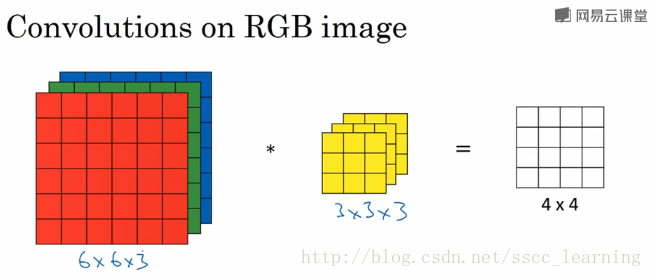
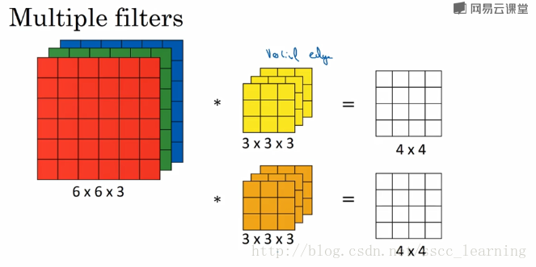
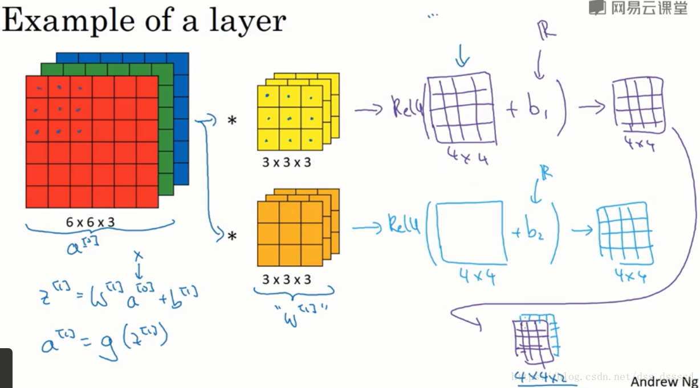
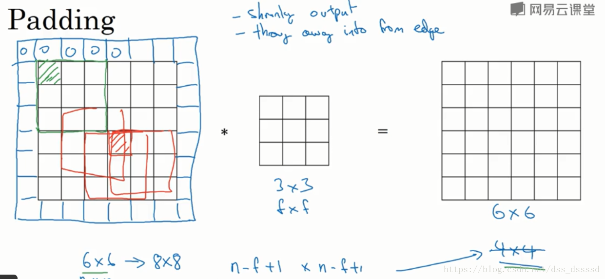
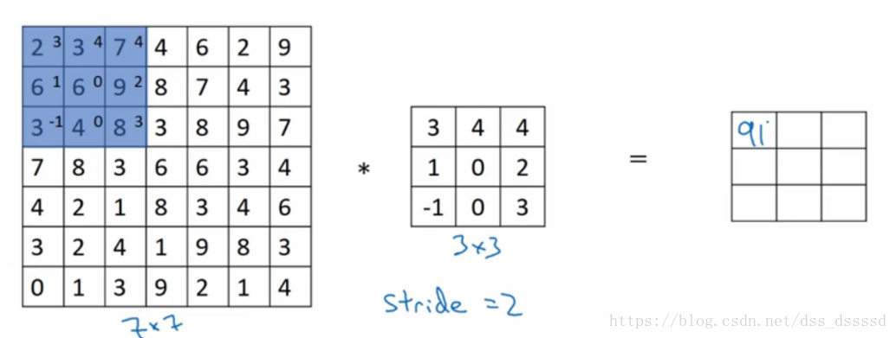
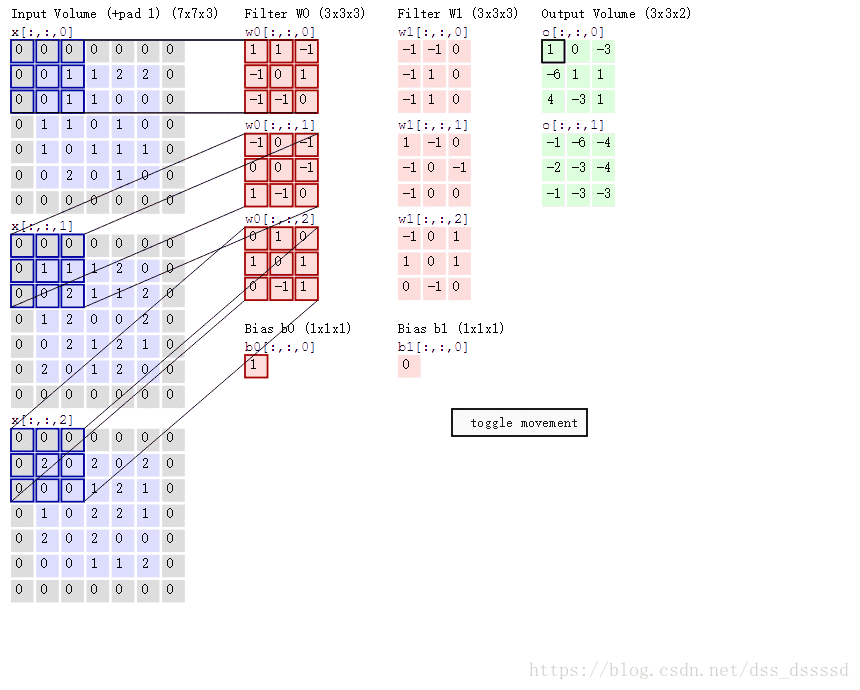

### **convolution operation**: share the convolution core

output size is:
$$
O = (n-f+1) * (n-f+1)
$$
where input size is $n\times n$, convolution core size is $f\times f$.

### **terms**: channels, strides, padding

* **channels**: look following picture, the input is  $6\times 6\times 3$ RGB picture, and we use $3\times 3\times 3$  convolution core, the last 3 is the channel number of  convolution core, which is same as the input picture channel number. During convolution, we multiply the input and add it together , so the output size is $4\times 4\times 1$.

and we often not only use only one convolution core, we use multi-cores to get multi-features form input. The following image shows the situation that we use two cores, so the output size is $4\times 4\times 2$. Then the input channel of following convolution layer is 2.

output size:
$$
O =(n-f+1) * (n-f+1) * C_o
$$
where $C_o$ is the number of convolution cores(output channel).

* **padding**: add data to the border of input, often to make sure the output size is same as input. 

  

  output size:
  $$
  O =(n+2p-f+1) * (n+2p-f+1) * C_o
  $$
  where $p$ is padding length of one side. e.g. the last picture $p = 1$.

  if you want to make sure output size is same as input, set $p = (f-1)/2$, since at this moment, $n-f+2p+1 = n$.

* **strides**: stripe is the moving step length of convolution core.

output size:
$$
O =(\frac{n+2p-f}{s}+1) * (\frac{n+2p-f}{s}+1) * C_o
$$
where $s$ is stride length.

### **demo**

So lets get the demo's output size: 

---

$$
\begin{equation}
\begin{aligned}
p=1\\
s=2\\
S_{input} &= 7*7*3\\
S_{core} &= 3*3*3\\
S_{out} &= (\frac{n+2p-f}{s}+1) * (\frac{n+2p-f}{s}+1) * C_o \\
&= (\frac{7+2-3}{2}+1) * (\frac{7+2-3}{2}+1) * 2 \\&= 4*4*2
\end{aligned}
\end{equation}
$$

