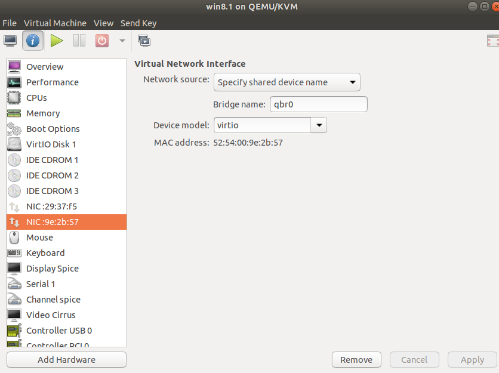
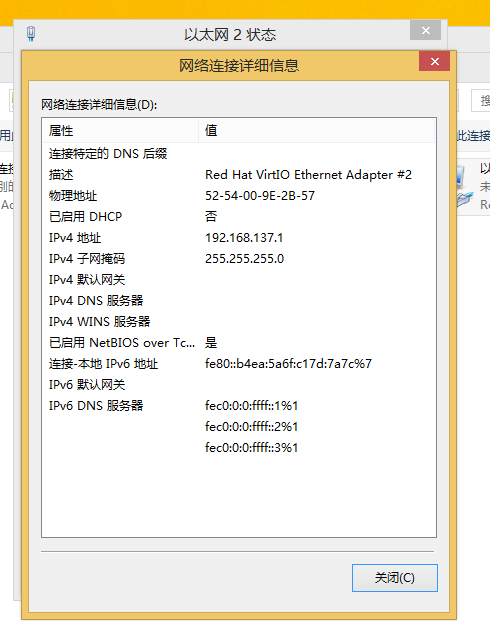
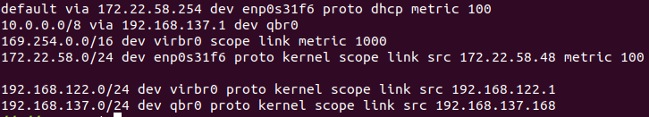

## Enabling SSL VPN on linux

### Why?

Many ssl vpn software companies(such as Huawei, Sangfor etc.) do not have Linux client,  so we need to use virtual  machine to run the windows client and bridge the network to Linux. Ref. this [post](<https://zsrkmyn.github.io/how-to-use-sangfor-sslvpn-in-linux.html>) which is in Chinese(LOL). 

### How to install windows on qemu hosted on ubuntu18.04

1. First, make sure you properly install "qume-kvm" and "virt-manager "
2. Download win installation ISO file and [VirtIO](<https://fedoraproject.org/wiki/Windows_Virtio_Drivers>) IOS file.
3. Start *Virtual Machine Manager* to run GUI installing guide.  Like this:
4. then following [this wiki](<https://github.com/hpaluch/hpaluch.github.io/wiki/Install-Windows7-on-KVM-Qemu>) to install.

**Notice:** In my test case, Huawei's VPN software doesn't work on win7, it only works on win8 or later.

### How to bridge

1. On Linux host add and start a bridge:

```
ip l add qbr0 type bridge
ip l set qbr0 up
```

2. Add this bridge network card(NC) to virtual machine like this

3. set up the VPN NC share to bridge NC on guest machine

4. start the VPN SSL software on Windows, the windows set you bridge NC ip as `192.168.137.1`. show in figure

   

5. on host open bridge's DHCP and change the route table to redirect inner ip through bridge via gateway ip `192.168.137.1`: 
```bash
sudo dhclient -i qbr0
sudo ip r add 10.0.0.0/8 via 192.168.137.1 dev qbr0
```
6. Verify by  `ip r` like this, where  `172.xx.xx.xx` is my host NC ip, `192.168.122.xx` is virtual machine bridge IP for Internet, and `192.168.137.x` is for bridge VPN. Oh, my God, how complex it is!!!

   

7. Enjoy it !

   `ssh xxx@10.xx.xx.xx` 

8. However, it is fucking slow on my machine. Is my network problem or configuration problem? I do not know, but maybe fast on your condition.


Thinks for reading!