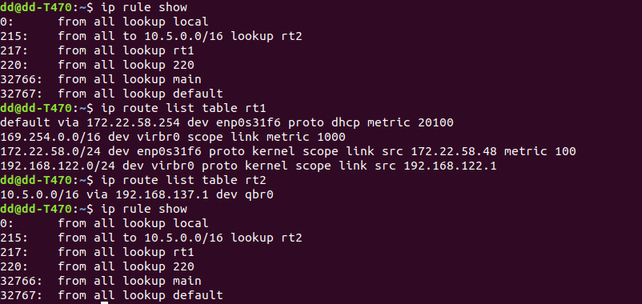
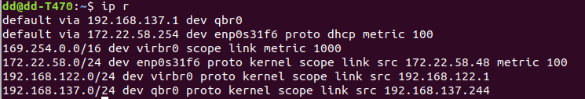

## Enabling SSL VPN on linux

### Why?

Many ssl vpn software companies(such as Huawei, Sangfor etc.) do not have Linux client,  so we need to use virtual  machine to run the windows client and bridge the network to Linux. Ref. this [post](<https://zsrkmyn.github.io/how-to-use-sangfor-sslvpn-in-linux.html>) which is in Chinese(LOL). 

### How to install windows on qemu hosted on ubuntu18.04

1. First, make sure you properly install "qume-kvm" and "virt-manager "
2. Download win installation ISO file and [VirtIO](<https://fedoraproject.org/wiki/Windows_Virtio_Drivers>) IOS file.
3. Start *Virtual Machine Manager* to run GUI installing guide.  Like this:
4. then following [this wiki](<https://github.com/hpaluch/hpaluch.github.io/wiki/Install-Windows7-on-KVM-Qemu>) to install.

**Notice:** In my test case, Huawei's VPN software doesn't work on win7, it only works on win8 or later.

### How to bridge

1. On Linux host add and start a bridge:

```
sudo ip l add qbr0 type bridge
sudo ip l set qbr0 up
```

2. Add this bridge network card(NC) to virtual machine like this

3. set up the VPN NC share to bridge NC on guest machine

4. start the VPN SSL software on Windows, the windows set you bridge NC ip as `192.168.137.1`. show in figure

   

5. on host open bridge's DHCP 
```bash
sudo dhclient -i qbr0
```
6. and we have to change the route table to redirect our inner address to the 'qbr0' through DHCP gateway, you can simply run `sudo ip r add 10.5.0.0/16 via 192.168.137.1 dev qbr0`, but now there will have two default route, so you may encounter some trouble that con not connect the Internet, thus, we need to route table to handle this.

   1. create two route table by edit file `/etc/iproute2/rt_tables` 

      ```bash
      #
      # reserved values
      #
      255     local
      254     main
      253     default
      0       unspec
      #
      # local
      #
      #1      inr.ruhep
      1 rt1
      2 rt2
      ```

   2. set up your route table and route rules for specific connection

      ```bash
      sudo ip route add default via 172.22.58.254 dev enp0s31f6 proto dhcp metric 100  table rt1
      sudo ip route add 10.5.0.0/16 via 192.168.137.1 dev qbr0 table rt2
      
      sudo ip rule add to 10.5.0.0/16 lookup rt2
      sudo ip rule add 0/0 lookup rt1
      ```

      your result just like this

      ```
      ip rule show
      ip route list table rt1
      ip route list table rt2
      ```

      

7. Verify by  `ip r` like this, where  `172.xx.xx.xx` is my host NC ip, `192.168.122.xx` is virtual machine bridge IP for Internet, and `192.168.137.x` is for bridge VPN. Oh, my God, how complex it is!!!

   

8. Enjoy it !

   `ssh xxx@10.xx.xx.xx` 


Thinks for reading!