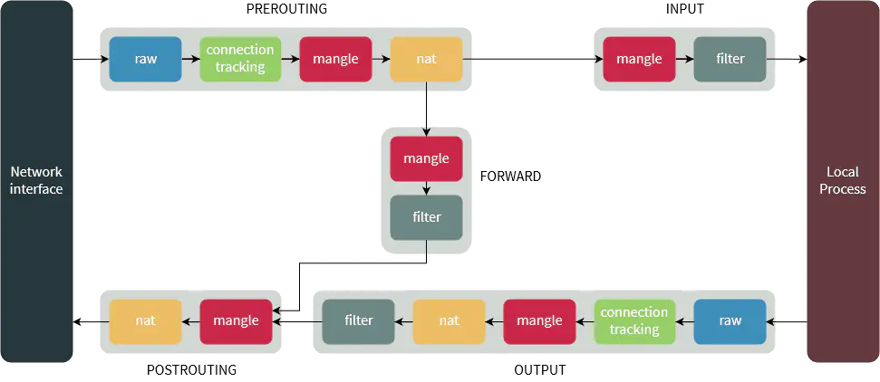

# Background

[My previous](https://dongdongbh.tech/blog/vps/) post that show how to set up a proxy server and use it on various clients, while setting up the client on every device is cumbersome. In addition, people may want to forward all network traffic through proxy regardless it is http/https/socks5 or not.  In these situations, it is better to set up a global proxy works as a router, all devices (includes itself) connected to it would use the proxy, which is called **transparent proxy**, people also call it bypass gateway or soft router. Most of these methods directly work on tcp/upd.

In this post, I will demonstrate how to set up transparent proxy on Linux step by step. In order to understand this post, you should know basics about Linux and networks.

There many tools to achieve transparent proxy, like Proxifier (Windows), *Surge for Mac*,  tun2socks, dns2socks for Linux etc. The key of transparent proxy how to **proxy DNS**. In this post, I didn't use these tools. I only  adopt the V2ray and clash build-in DNS configuration. In fact, Clash has pretty good DNS setting.

## Basics about DNS

### How DNS works?

When you set a http request, it first sent a DNS request (on UDP port 53) with domain name as a payload to the predefined DNS server using local DNS requesting tool, then the DNS request reach the name server, it returns corresponding IP address. Then the app lunch a TCP connection to the destination server with this IP and tcp data stream. That's how the normal  http/https connection works.

```
            DNS req
   ___________________________>
APP<---------------------------DNS server
  |         web IP
  |         IP and TCP data
  |----------------------------------->website  	
```


When you using a proxy client/server, things may change.  In the following part of this section, I only the DNS work with proxy direction. The direct link is similar as the  normal  http connection works

#### socks5

In socks5 case, the app packs domain name and tcp data stream to socks5 packages. The client program sent socks5 data (domain name and tcp data stream) to the proxy server with some proxy protocol, the the DNS resolution is work on the  proxy server. 

```
      socks5(domain and tcpdata)          socks5 data /w proxy protocol                                    DNS req
APP--------------------------------->proxy client------------------------------------->proxy server<------------------->DNS server
                                                                                          |     web IP
                                                                                          |
                                                                                          |     IP and TCP data
                                                                                          |--------------------------------website  
```

When **global proxy/transparent proxy** is required, not all apps has the socks packing function, so there have to be a program that catches the DNS request and make it works as we want. 

#### tun2socks/redir

**tun2socks** is part of `BadVPN` which accepts all incoming TCP connections (regardless of destination IP), and forwards them through a SOCKS server. This allows you to forward all connections through SOCKS, without any need for application support. It can be used, for example, to forward connections through a remote SSH server or through Tor. Because of how it works, it can even be installed on a Linux router to transparently forward clients through SOCKS.

In this case, the program catches the DNS request, and gets the IP address by it's own way (the result may wrong due to dirty DNS servers), and it return it to the APP, the APP then lunch a TCP connection with this IP and the  tcp data stream. But in local program, it just packs previous domain name and tcp data stream to as a socks package. then set to the proxy server, and let the proxy server do the actual DNS request.

```
         requested IP
   <_________________________________           domian and data w/ proxy protocol                      DNS req
APP--------------------------------->proxy client<------------------------------------->proxy server<------------------->DNS server
  |              DNS req               /|\                                                    |      web IP
  |                                     |                                                     |
  |       IP and TCP data               |                                                     |    IP and TCP data     
  |-------------------------------------|                                                     |---------------------------->website
```

#### Fake IP

Fake IP mode is that the local proxy client catches DNS requests, then return a self-produced fake IP to APP. The APP would lunch a TCP connection with this fake IP and it's TCP data. When the local proxy client search the domain name with this fake IP, and send the domain name and TCP data to the proxy server,  and let the proxy server do the actual DNS request.

```
          Fake IP
   <_________________________________        domian and data w/ proxy protocol                           DNS req
APP--------------------------------->proxy client<------------------------------------->proxy server<------------------->DNS server
  |              DNS req               /|\                                                   |      web IP
  |                                     |                                                    |
  |   IP and TCP data                   |                                                    |    IP and TCP data     
  |-------------------------------------|                                                    |---------------------------->website
```


#### pros & cons

Fake IP mode is a bit faster since it do not have to send a real IP to local APP, but the local app can not know the real IP of website.

### Iptables

if you don't familiar with `iptables ` and `ip route`, please do your own research. Here is a good picture for  `iptables` overview.



```
iptables -L -t {nat, mangle}   # list chains
iptables -N  XXXX				# creat chain
iptables -A      				# add rule
iptables -D      				# delete rule
```

# Requirements

* You should have a Linux computer/device;

* You should an available v2ray/clash proxy.

## Set up a V2ray  transparent proxy

### V2ray `config.json`

```json
{
"routing": {...},
"inbounds": [
 {
   ...
 },
 {
   "port": 12345, //opening port
   "protocol": "dokodemo-door",
   "settings": {
     "network": "tcp,udp",
     "followRedirect": true // receive packages from iptables
   },
   "sniffing": {
     "enabled": true,
     "destOverride": ["http", "tls"]
   },
   "streamSettings": {
     "sockopt": {
       "tproxy": "redirect" 
     }
   }

 }
],
"outbounds": [
 {
   ...
   "streamSettings": {
     ...
     "sockopt": {
       "mark": 255  // SO_MARK，for iptables 
     }
   }
 }
 ...
]
}
```

### `iptables` setting

```bash
lan_ipaddr="192.168.1.1"   # local router IP
proxy_server="123.123.123.123"  # tour proxy server
proxy_port="7892"           # transparent proxy forward port

# allow ip forward
echo net.ipv4.ip_forward=1 >> /etc/sysctl.conf && sysctl -p

# set route for lo back to perouting
ip rule add fwmark 1 table 100
ip route add local 0.0.0.0/0 dev lo table 100


# proxy local network
iptables -t mangle -N V2RAY

# Ignore your V2Ray server's addresses
# It's very IMPORTANT, just be careful.
iptables -t mangle -A V2RAY -d ${proxy_server} -j RETURN

iptables -t mangle -A V2RAY -d 127.0.0.1/32 -j RETURN
iptables -t mangle -A V2RAY -d 224.0.0.0/4 -j RETURN
iptables -t mangle -A V2RAY -d 255.255.255.255/32 -j RETURN
iptables -t mangle -A V2RAY -d ${lan_ipaddr}/16 -p tcp -j RETURN # direct for local network
iptables -t mangle -A V2RAY -d ${lan_ipaddr}/16 -p udp ! --dport 53 -j RETURN # direct for local network except 53 port for DNS
iptables -t mangle -A V2RAY -p udp -j TPROXY --on-port ${proxy_port} --tproxy-mark 1 # set mark 1 to UDP，forward to proxy
iptables -t mangle -A V2RAY -p tcp ! --dport 22 -j TPROXY --on-port ${proxy_port} --tproxy-mark 1 # set mark 1 to TCP，forward to proxy, except 53 port for SSH
iptables -t mangle -A PREROUTING -j V2RAY # apply to perounting

# proxy this machine
iptables -t mangle -N V2RAY_MASK
iptables -t mangle -A V2RAY_MASK -d ${proxy_server} -j RETURN

iptables -t mangle -A V2RAY_MASK -d 224.0.0.0/4 -j RETURN
iptables -t mangle -A V2RAY_MASK -d 255.255.255.255/32 -j RETURN
iptables -t mangle -A V2RAY_MASK -d ${lan_ipaddr}/16 -p tcp -j RETURN # direct for local network
iptables -t mangle -A V2RAY_MASK -d ${lan_ipaddr}/16 -p udp ! --dport 53 -j RETURN #  direct for local network except 53 port for DNS
iptables -t mangle -A V2RAY_MASK -j RETURN -m mark --mark 0xff    # set SO_MARK as 0xff to avoid loop back
iptables -t mangle -A V2RAY_MASK -p udp -j MARK --set-mark 1   # mark UDP and reroute
iptables -t mangle -A V2RAY_MASK -p tcp -j MARK --set-mark 1   # mark UDP and reroute
iptables -t mangle -A OUTPUT -j V2RAY_MASK # apply to output of this machine
```

Here we use the DNS of V2ray. We first set up forward traffic to proxy, then we re-sent all packages of this machine back to itself  as if it if forwarding, then just follow the forward rules to proxy.

This method is the REDIRECT method, their is a TPROXY method for V2ray, but I didn't make it works on my machine, if you instrested, see [̧here](https://toutyrater.github.io/app/tproxy.html) for refernce.

## Set up a Clash  transparent proxy

**Clash** is a rule based *proxy*. It has proxy, high level routing, DNS and a lot more functions. It's a really popular tool. 

### Bypass gateway

Supposing that you are using Raspberry Pi as your bypass gateway. You should set  a static Raspberry address and let it works as DHCP and DNS server of the main server, or if you main router support multiple gateway, you may open two gateway on the main router, one for proxy which go through Raspberry and back, the other just works as normal router gateway. Just as this network overview graph.

```
Phone/PC/Pad
        |
      1 |
        |
+-------v-------+      2      +---------------+
|               |------------->               |
|  WiFi router  |             |  Raspberry Pi |
|               <-------------|               |
+------+--+-----+      3      +---------------+
       |  |
    3.1|  | 3.2
       |  +---------->  China LAN
       v
   +---+---+
   | Proxy |
   +---+---+
       |
       |
       v
 Internet WAN
```

### The loop problem

To avoid the loop problem, a `clash` user is created, clash is run by `clash`, `ipatables` use uid to identify the traffic from clash. 

Create a user `clash`,  make sure you create a home dir for clash, otherwise there is no place for clash config file toinit.

```
useradd -U clash
sudo mkhomedir_helper clash
sudo chown clash:clash /usr/local/bin/clash
```

creat or change `/etc/systemd/system/clash.service`, which define user as clash

```
[Unit]
Description=clash
After=network.target

[Service]
User=clash
Group=clash
AmbientCapabilities=CAP_NET_BIND_SERVICE CAP_NET_ADMIN
ExecStart=/usr/local/bin/clash -d /etc/clash
Restart=on-failure

[Install]
WantedBy=multi-user.target
```

Here we set `AmbientCapabilities` for DNS, since we `clash` user to run service, it can not use 53 port, we need `CAP_NET_BIND_SERVICE` permission. And if we we want to proxy UDP, we need `CAP_NET_ADMIN` permission.

```
sudo systemctl daemon-reload
sudo systemctl enable clash
```

#### Clash DNS setting in `config.yaml`

For DNS, here we want to use the DNS of Clash, let clash do the DNS job since our local DNS may dirty. add following lines to  `config.yaml` of clash

```
dns:
  enable: true
  ipv6: false
  listen: 0.0.0.0:1053
  enhanced-mode: redir-host       # redir-host or fake-ip
  # fake-ip-range: 198.18.0.1/16    # Fake IP addresses pool CIDR
  use-hosts: true                 # lookup hosts and return IP record
  nameserver:
    - 119.29.29.29      # DNSpod 
    - 223.5.5.5         # Ali
  # if not china then use fallback
  fallback:
    - tls://8.8.8.8:853         # Google DNS over TLS 50ms
    - tls://8.8.4.4:853         # cloudflare DNS over TLS 50ms
    - https://1.1.1.1/dns-query # cloudflare DNS over HTTPS
    - https://dns.google/dns-query # Google DNS over HTTPS

  # Force DNS use fallback
  fallback-filter:
    # true: CN use nameserver resolution， no CN use fallback
    geoip: true
    # take effect when geoip set as false : when do not match `ipcidr` use `nameserver`, match `ipcidr` use `fallback`.
    ipcidr:
      - 240.0.0.0/4
```

Here, DNS sets as `redir-host` mode, you can also use `fake-ip` mode with

```
  enhanced-mode:  fake-ip       # redir-host or fake-ip
  fake-ip-range: 198.18.0.1/16    # Fake IP addresses pool CIDR
```

and make sure you also set the `iptables` accordingly.

the `config.yaml` like this 

```
port: 7890
socks-port: 7891
redir-port: 7892
allow-lan: true
mode: Rule
log-level: info
external-controller: 0.0.0.0:9090
secret: ""
external-ui: dashboard
# your proxy
Proxy: 
Proxy Group:
#
Rule:
# 
dns:
  enable: true
```

#### `iptables` setting 

first, allow forward ip

```
echo net.ipv4.ip_forward=1 >> /etc/sysctl.conf && sysctl -p
```

set up `iptables`

```
lan_ipaddr="192.168.1.1"   # local router IP
dns_port="1053"             # DNS FORWARD port
proxy_port="7892"           # transparent proxy forward port

iptables -t nat -N CLASH_TCP_RULE    #creat new nat rule
iptables -t nat -F CLASH_TCP_RULE


iptables -t nat -I PREROUTING -p tcp -d 8.8.8.8 -j REDIRECT --to-port "$proxy_port"
iptables -t nat -I PREROUTING -p tcp -d 8.8.4.4 -j REDIRECT --to-port "$proxy_port"
iptables -t nat -A PREROUTING -p tcp  -j CLASH_TCP_RULE
# Fake-IP rule
# iptables -t nat -A OUTPUT -p tcp -d 198.18.0.0/16 -j REDIRECT --to-port ${proxy_port}


# do not forward local address
iptables -t nat -A CLASH_TCP_RULE -d 10.0.0.0/8 -j RETURN
iptables -t nat -A CLASH_TCP_RULE -d 127.0.0.0/8 -j RETURN
iptables -t nat -A CLASH_TCP_RULE -d 169.254.0.0/16 -j RETURN
iptables -t nat -A CLASH_TCP_RULE -d 172.16.0.0/12 -j RETURN
iptables -t nat -A CLASH_TCP_RULE -d ${lan_ipaddr}/16 -j RETURN

# do not forward ssh, clash http socks ports, transparent proxy port, clash web API port
iptables -t nat -A CLASH_TCP_RULE -p tcp --dport 22 -j RETURN
iptables -t nat -A CLASH_TCP_RULE -p tcp --dport 7890 -j RETURN
iptables -t nat -A CLASH_TCP_RULE -p tcp --dport 7891 -j RETURN
iptables -t nat -A CLASH_TCP_RULE -p tcp --dport 7892 -j RETURN
iptables -t nat -A CLASH_TCP_RULE -p tcp --dport 9090 -j RETURN

# proxy_port take over HTTP/HTTPS request
iptables -t nat -A CLASH_TCP_RULE  -p tcp -j REDIRECT --to-ports ${proxy_port}

# forward DNS request to dns_port
iptables -t nat -N CLASH_DNS_RULE
iptables -t nat -F CLASH_DNS_RULE

iptables -t nat -A PREROUTING -p udp -s ${lan_ipaddr}/16 --dport 53 -j CLASH_DNS_RULE
iptables -t nat -A CLASH_DNS_RULE -p udp -s ${lan_ipaddr}/16 --dport 53 -j REDIRECT --to-ports $dns_port
iptables -t nat -I OUTPUT -p udp --dport 53 -j CLASH_DNS_RULE
iptables -t nat -A OUTPUT -p tcp -m owner ! --uid-owner clash -j REDIRECT --to-port ${proxy_port}

```

Here we didn't proxy UDP, only proxy DNS on 53 port. see ref [Clash TProxy Mode](https://lancellc.gitbook.io/clash/start-clash/clash-udp-tproxy-support) for UDP proxy.

### Save and reload `iptables`

```
sudo apt install iptables-persistent
iptables-save > /etc/iptables/rules.v4
```


__Special statement: This tutorial is only for learning and research, thanks.__

